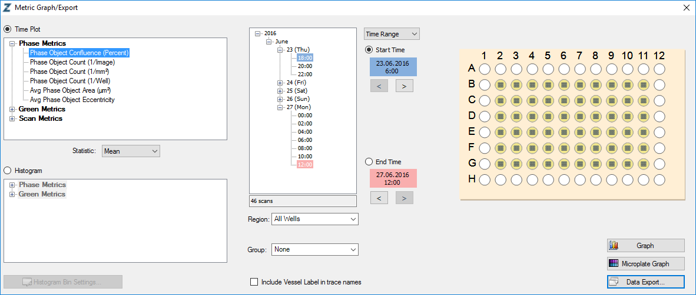
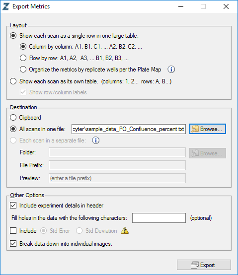
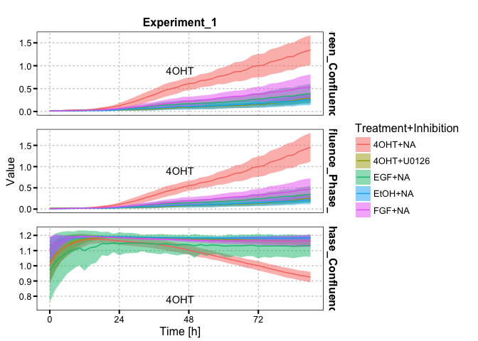
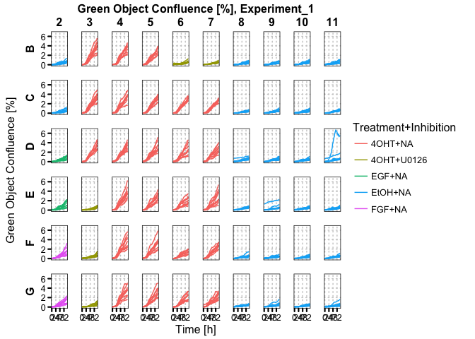

incucyter
================

`incucyter` is an R package to read, annotate, normalise and plot IncuCyte ZOOM® metrics.

Installation
============


    if(!library(devtools, logical.return = T)) install.packages("devtools")
    if(!library(tidyverse, logical.return = T)) install.packages("tidyverse")
    devtools::install_github("uhlitz/incucyter")

Quick start
===========

You can use incucyter to...

1.  read + annotate
2.  normalise
3.  plot

...IncuCyte ZOOM® metrics.

To do so, export your incucyte metrics with IncuCyte ZOOM® software using the following settings. File names are not relevant, all other settings are mandatory for `incucyter` to properly import the data:





1 read + annotate
-----------------

Example code to read and annotate incucyte metrics:

``` r
library(tidyverse)
library(incucyter)

example_data <- system.file("extdata", 
                            c("sample_data_GO_Confluence_percent.txt",
                              "sample_data_PO_Confluence_percent.txt"),
                            package = "incucyter")

example_annotation <- system.file("extdata", 
                                  "sample_data_annotation.tsv",
                                  package = "incucyter")

incu_tbl <- read_incu(file = example_data,
                      annotation = example_annotation)
```

Your annotation table must contain four columns: *Analysis\_Job*, *Well*, *Treatment* and *Reference*. You can freely add other columns and use these columns to summarise your data for plotting or summary statistics.

To annotate your table, you can use `read_incu` with a file path to a tab delimited annotation file or with a R `data.frame`.

An example annotation can look like this:

| Analysis\_Job | Well | Treatment | Inhibition | siRNA | siRNA\_id |  siRNA\_conc|  HiPerfect\_conc| Reference |
|:--------------|:-----|:----------|:-----------|:------|:----------|------------:|----------------:|:----------|
| Experiment\_1 | B2   | EtOH      | NA         | NA    | NA        |           NA|               NA| B3,C3,D3  |
| Experiment\_1 | C2   | EtOH      | NA         | NA    | NA        |           NA|               NA| B3,C3,D3  |
| Experiment\_1 | D2   | EGF       | NA         | NA    | NA        |           NA|               NA| B3,C3,D3  |
| Experiment\_1 | E2   | EGF       | NA         | NA    | NA        |           NA|               NA| B3,C3,D3  |
| Experiment\_1 | F2   | FGF       | NA         | NA    | NA        |           NA|               NA| B3,C3,D3  |
| Experiment\_1 | G2   | FGF       | NA         | NA    | NA        |           NA|               NA| B3,C3,D3  |
| Experiment\_1 | B3   | 4OHT      | NA         | NA    | NA        |           NA|               NA| B3,C3,D3  |
| Experiment\_1 | C3   | 4OHT      | NA         | NA    | NA        |           NA|               NA| B3,C3,D3  |
| Experiment\_1 | D3   | 4OHT      | NA         | NA    | NA        |           NA|               NA| B3,C3,D3  |
| Experiment\_1 | E3   | 4OHT      | U0126      | NA    | NA        |           NA|               NA| B3,C3,D3  |
| Experiment\_1 | F3   | 4OHT      | U0126      | NA    | NA        |           NA|               NA| B3,C3,D3  |
| Experiment\_1 | G3   | 4OHT      | U0126      | NA    | NA        |           NA|               NA| B3,C3,D3  |
| Experiment\_1 | B4   | 4OHT      | NA         | Mock  | \*        |           10|                2| B4,B5     |
| Experiment\_1 | B5   | 4OHT      | NA         | Mock  | \*        |           10|                2| B4,B5     |
| Experiment\_1 | B6   | 4OHT      | U0126      | Mock  | \*        |           10|                2| B4,B5     |
| Experiment\_1 | B7   | 4OHT      | U0126      | Mock  | \*        |           10|                2| B4,B5     |
| Experiment\_1 | B8   | EtOH      | NA         | Mock  | \*        |           10|                2| B4,B5     |
| Experiment\_1 | B9   | EtOH      | NA         | Mock  | \*        |           10|                2| B4,B5     |
| Experiment\_1 | B10  | EtOH      | NA         | Mock  | \*        |           10|                2| B4,B5     |
| Experiment\_1 | B11  | EtOH      | NA         | Mock  | \*        |           10|                2| B4,B5     |

2 normalise
-----------

You can normalise your data to a reference metric and/or to a set of referece wells. For the first, `calc_incu_ratios` calculates all ratios between the different metrics in your table. These ratios can be plotted with `plot_metric` like any other metric. For the latter, `norm_incu` normalises your metrics to a given reference time point and a given set of reference wells (specified as a column in your annotation table, see above).

``` r
incu_tbl_comp <- calc_incu_ratios(incu_tbl)
incu_tbl_comp_norm <- norm_incu(incu_tbl_comp, ref_time = 72)
```

3 plot
------

You can plot multiple metrics with `plot_metrics` or a microplate overview plot with `plot_microplate`.

``` r
incu_tbl_comp_norm %>% 
  filter(is.na(siRNA)) %>% 
  plot_metrics(color = c("Treatment", "Inhibition"), 
               label = c("Treatment", "Inhibition"), summarise = T)
```



``` r
incu_tbl %>% 
  filter(Metric == "Green_Confluence") %>% 
  plot_microplate(color = c("Treatment", "Inhibition"))
```


